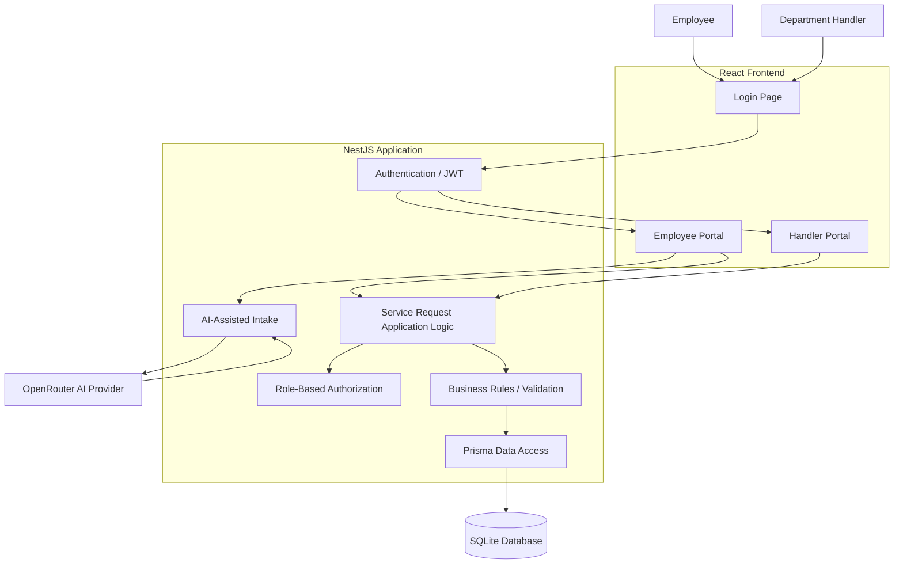

# Internal Operations Service Hub - Architecture
## 1. Purpose and Scope
### Purpose
The purpose of this architecture is to define the current high-level structure of the Internal Operations Service Hub and the responsibilities of its main components.
The system provides a central place for employees to submit internal service requests and for internal department handlers in IT, HR, and Finance to receive, claim, process, and complete those requests.
The current implementation also includes AI-assisted request intake. AI helps structure an employee's request, but it does not own final routing or persistence decisions.
### Current Scope
The current architecture supports:
- User authentication with email and password.
- JWT-based authenticated sessions.
- Role-based access for employees and handlers.
- AI-assisted request intake.
- Human review before request submission.
- Persistent service request creation.
- Department-based request routing.
- Department-specific handler inboxes.
- Request claiming and ownership.
- Controlled request lifecycle transitions.
- Status-change audit history.
- Automated unit, integration, evaluation, and end-to-end testing.
The following capabilities are not part of the current implementation:
- Approval workflows.
- Notifications.
- Password reset.
- Email verification.
- Refresh tokens.
- OAuth or social login.
- Administrator portal.
- Multi-tenant architecture.
These may be considered future extensions and should not be treated as implemented behavior.

## 2. Actors
### Employee / Requester
An employee who authenticates with the system and submits internal service requests.
Current employee capabilities include:
- Sign in.
- Describe an internal request.
- Use AI-assisted intake.
- Review the AI suggestion.
- Submit a Service Request.
- Have their authenticated identity associated with the request.
### Request Handler
A staff member assigned to an internal department such as IT, HR, or Finance.
Current handler capabilities include:
- Sign in.
- Access the inbox for their department.
- View requests routed to their department.
- Claim an unassigned request.
- Move an assigned request through valid lifecycle states.
- Complete a request.
A handler cannot claim requests belonging to another department and cannot change the status of a request assigned to another handler.

## 3. Current Technology Structure
The current implementation uses:
### Frontend
```text
React
TypeScript
Vite
```
The frontend is organized by responsibility:
```text
frontend/src/
├── api/
├── components/
├── pages/
├── styles/
├── types/
├── utils/
└── App.tsx
```
Main frontend workspaces:
```text
LoginPage
EmployeePortal
HandlerPortal
```
### Backend
```text
NestJS
TypeScript
Passport
JWT
bcrypt
class-validator
```
The backend owns:
- Authentication.
- Authorization.
- Validation.
- Request lifecycle rules.
- Request ownership rules.
- Department access rules.
- Persistence coordination.
- AI output validation.
### Persistence
```text
Prisma ORM
SQLite
```
The current relational model contains:
```text
User
Department
ServiceRequest
ServiceRequestStatusHistory
```
### AI Provider Boundary
AI-assisted intake is accessed through a provider abstraction.
The current external AI integration uses OpenRouter.
The application does not trust arbitrary AI output. AI responses are validated against product-owned departments, categories, priorities, and cross-field rules before they are accepted.

## 4. High-Level Architecture

The diagram represents responsibility boundaries rather than every individual HTTP call.

## 5. Authentication Flow
Authentication is implemented by the backend.
```text
Email + Password -> User lookup -> bcrypt password verification -> JWT creation -> Authenticated frontend session
```
Main authentication endpoints include:
```http
POST /auth/login
GET /auth/me
```
The JWT contains authenticated identity information used by protected backend operations.
The frontend may store and send the token, but it is not trusted to declare the user's identity.

## 6. Authorization Boundary
Authentication and authorization are separate responsibilities.
Authentication determines:
```text
Who is this user?
```
Authorization determines:
```text
What is this user allowed to do?
```
Current roles:
```text
EMPLOYEE
HANDLER
```
Role-based authorization is enforced in the backend using guards and role metadata.
Examples:

```text
EMPLOYEE → Submit Service Request
HANDLER → Access Department Inbox
        → Claim Request
        → Change Request Status
```
The frontend may hide actions that do not apply to a role, but frontend visibility is not treated as a security control.

## 7. AI-Assisted Request Intake
AI is used as an advisory capability during employee request intake.
The employee provides free-text input.
The AI capability produces a bounded structured suggestion containing:

```text
department
category
priority
summary
needsReview
```
Product-owned departments are:
```text
IT
HR
Finance
```
The application validates AI output before presenting it as a usable suggestion.
The authority model is:
```text
AI proposes → Software validates → Employee reviews → Employee explicitly submits → Backend persists
```
AI does not directly create or modify durable Service Request state.
If the result is ambiguous or unsafe to classify automatically, the system uses:
```text
needsReview = true
```
and avoids silently inventing a department or category.

## 8. Service Request Submission Flow
The current employee submission flow is:
```text
Employee Login -> Employee Portal -> Describe Request -> AI Analysis -> Review Suggestion -> Submit Request
-> NestJS Validation / Authorization -> Prisma -> SQLite
```
When a request is created:
```text
employeeId = authenticated employee
handlerId = null
status = submitted
```
The client does not provide the authenticated employee identity.

## 9. Department Routing and Handler Inbox
A Service Request belongs to a department.
Handlers also belong to a department.
The handler inbox uses the authenticated handler's department identity.
Example:
```text
IT Handler
→ IT Inbox

HR Handler
→ HR Inbox

Finance Handler
→ Finance Inbox
```
The department filter is determined by the backend rather than accepted as an arbitrary client-controlled authorization value.

## 10. Request Assignment Flow
New Service Requests are initially unassigned:
```text
handlerId = null
```
A handler can claim an unassigned request when the request belongs to the same department as the handler.
```text
Department Inbox -> Unassigned Request -> Claim Request -> Backend verifies department -> handlerId = authenticated handler
```
The backend rejects:
- Claims from handlers in another department.
- Claims from handlers without a department.
- Claims for requests that are already assigned.

## 11. Request Lifecycle
The current lifecycle is intentionally small and explicit:
```text
submitted -> in_progress -> completed
```
Valid transitions:
```text
submitted → in_progress
in_progress → completed
```
Examples of invalid transitions:
```text
submitted → completed
completed → in_progress
```
Lifecycle validation is enforced by the backend.
Only the assigned authenticated handler can change the status of a request.
---

## 12. Audit History and Transaction Boundary
Status changes are recorded in:
```text
ServiceRequestStatusHistory
```
Each record stores:
```text
serviceRequestId
fromStatus
toStatus
changedByUserId
createdAt
```
Status updates and history creation are performed within a Prisma transaction.
```text
Update ServiceRequest status + Create StatusHistory record -> Single transaction
```
This prevents the request status from being updated without its corresponding audit record if part of the operation fails.

## 13. Persistent Data Model
The current persistent entities are:
### User
Represents authenticated employees and handlers.
Important responsibilities include:
- Identity.
- Email.
- Password hash.
- Role.
- Optional department membership.
### Department
Represents an internal operational department.
Current departments include:
```text
IT
HR
Finance
```
### ServiceRequest
Represents the durable internal request.
It includes:
```text
employeeId
departmentId
handlerId
title
description
category
priority
status
createdAt
updatedAt
```
### ServiceRequestStatusHistory
Represents an auditable lifecycle transition.
It records:
```text
serviceRequestId
fromStatus
toStatus
changedByUserId
createdAt
```
Detailed relationships are documented in `data-model.md`.

## 14. Trust Boundaries
### Frontend Boundary
The frontend is considered untrusted for security-sensitive decisions.
The backend does not rely on the frontend to determine:
- Authenticated user identity.
- User role.
- Handler ownership.
- Valid lifecycle transitions.
- Cross-department authorization.
### AI Boundary
The AI provider is also treated as an untrusted advisory boundary.
AI output must be:
- Structured.
- Parsed defensively.
- Validated against product-owned values.
- Checked for valid department/category relationships.
AI output cannot directly mutate durable request state.
### Persistence Boundary
Durable state is stored through Prisma in SQLite.
Application logic validates and authorizes operations before durable state changes are performed.

## 15. Failure and Resilience Behavior
### Authentication Failure
Invalid credentials result in an authentication failure without exposing whether the email or password was specifically incorrect.
### Authorization Failure
Authenticated users attempting actions outside their role or ownership boundaries receive an authorization failure.
### Invalid Lifecycle Transition
The backend rejects invalid state transitions and preserves the previous valid state.
### Persistence Failure
If a status transition cannot complete successfully, the Prisma transaction prevents a partial lifecycle/audit update.
### AI Provider Failure
AI provider failures are converted into a stable application error rather than exposing provider-specific failure details as product behavior.
### Invalid AI Output
Malformed or product-invalid AI responses are rejected by the application validation boundary.

## 16. Testing Architecture
The backend uses multiple test levels.
### Unit Tests
Used for isolated business rules and service behavior.
Examples include:
- Valid lifecycle transitions.
- Invalid lifecycle transitions.
- Request creation.
- Assignment rules.
- Department rules.
### Integration Tests
Used to verify application logic against SQLite persistence.
### End-to-End Tests
The E2E flow verifies the application through HTTP boundaries.
Current full flow:
```text
Employee Login → Create Request → Handler Login → Department Inbox → Claim Request → Start Progress → Complete Request → Verify Persistence → Verify Audit History
```
### AI Evaluation Tests
A bounded evaluation set checks expected behavior for:
- Clear IT requests.
- Clear HR requests.
- Clear Finance requests.
- Priority signals.
- Thin input.
- Ambiguous input.
- Untrusted instructions.

## 17. Test Data Isolation
Development and automated testing use separate SQLite databases.
```text
Development → dev.db
Testing → test.db
```
Prisma migrations are applied to the test database before automated test execution.
This keeps test operations isolated from development data.

## 18. Key Architecture Decisions
### Decision 1: Backend Owns Business Rules and Authorization
The client is not trusted to enforce authorization or lifecycle rules.
**Reason:**
Security-sensitive and durable business behavior must remain consistent regardless of the client.
### Decision 2: Authenticated Identity Replaces Client-Provided Identity
Protected operations derive user identity from JWT authentication.
**Reason:**
The client must not be able to impersonate another employee or handler by sending another user's ID.
### Decision 3: Separate Employee and Handler Workspaces
The frontend presents different workspaces based on authenticated role.
**Reason:**
Employees and handlers have different responsibilities and workflows.
**Important:**
This is a usability decision, not the authorization boundary. Backend authorization remains authoritative.
### Decision 4: AI Remains Advisory
AI helps structure employee input but does not own durable business decisions.
**Reason:**
Routing, validation, authorization, and persistence remain product-owned responsibilities.
### Decision 5: Explicit Request Lifecycle
The request lifecycle uses a small set of allowed transitions.
**Reason:**
Explicit transitions are easier to validate, test, explain, and audit.
### Decision 6: Status Changes Produce Audit History
Lifecycle changes are recorded separately from the current request state.
**Reason:**
Current state alone does not explain how the request reached that state or who changed it.
### Decision 7: Status and History Update Atomically
The current status and its audit record are written inside one database transaction.
**Reason:**
The system should not persist one without the other.
### Decision 8: Separate Test Persistence
Automated tests use a dedicated SQLite database.
**Reason:**
Tests should be repeatable without modifying development data.