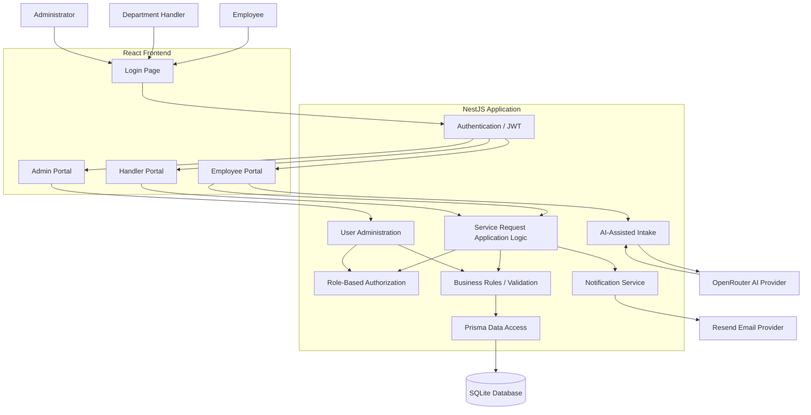

# Internal Operations Service Hub - Architecture
## 1. Purpose and Scope
 ### Purpose
 The purpose of this architecture document is to define the current high-level structure of the Internal Operations Service Hub, its trust boundaries, and the responsibilities of its main components.
 The system provides a central place for employees to submit and track internal service requests and for department handlers in IT, HR, and Finance to receive, claim, process, and complete those requests.
 The current implementation also includes:
 - JWT-based authentication.
 - Role-based authorization.
 - AI-assisted request intake.
 - Employee request tracking.
 - Department-specific handler workflows.
 - Request ownership and lifecycle management.
 - Request status history.
 - Administrator user management.
 - Account activation and deactivation.
 - Completion email notifications.
 - Stored-session validation.
 - Automated testing.
 Critical business rules and authorization decisions are owned by the backend Application Layer.
 ### Current Scope
 The current architecture supports:
 - User authentication with email and password.
 - JWT-based authenticated sessions.
 - `EMPLOYEE`, `HANDLER`, and `ADMIN` roles.
 - Backend-enforced role-based authorization.
 - AI-assisted request intake.
 - Human review before request submission.
 - Persistent service request creation.
 - Employee-specific request tracking.
 - Department-based request routing.
 - Department-specific handler inboxes.
 - Request claiming and ownership.
 - Controlled request lifecycle transitions.
 - Request details.
 - Status-change audit history.
 - Administrator user management.
 - Account activation and deactivation.
 - Completion email notifications.
 - Frontend stored-session validation.
 - Automated unit, integration, AI evaluation, and end-to-end testing.
  The following capabilities are not part of the current implementation:
 - Dedicated approval workflows.
 - File attachments.
 - Password reset.
 - Email verification.
 - Refresh tokens.
 - OAuth or social login.
 - Company SSO.
 - Advanced analytics.
 - SLA management.
 - Multi-tenant architecture.
 - Push or SMS notifications.
 These capabilities should not be treated as implemented behavior.

## 2. Actors
 ### Employee / Requester
 An employee authenticates with the system and submits internal service requests.
 Current employee capabilities include:
 - Sign in.
 - Describe an internal request.
 - Use AI-assisted intake.
 - Review the AI suggestion.
 - Submit a Service Request.
 - Have their authenticated identity associated with the request.
 - View their own requests.
 - View request details.
 - View current request status.
 - View assigned handler information when available.
 - View request status history.
 - Receive a completion email when a request is completed.
 Employees cannot access requests belonging to other employees.
 ### Request Handler
 A handler is a staff member assigned to an internal department such as IT, HR, or Finance.
 Current handler capabilities include:
 - Sign in.
 - Access the inbox for their department.
 - View requests routed to their department.
 - View request details for their department.
 - Claim an unassigned request.
 - Move an assigned request through valid lifecycle states.
 - Complete an assigned request.
 - View request status history.
 A handler cannot:
 - Access requests belonging to another department.
 - Claim requests belonging to another department.
 - Change the status of a request assigned to another handler.
 - Use employee-only request submission functionality.
 - Access administrator functionality.
 ### Administrator
 An administrator manages user access to the system.
 Current administrator capabilities include:
 - Sign in.
 - View system users.
 - Create employee accounts.
 - Create handler accounts.
 - Assign handlers to departments.
 - Activate employee and handler accounts.
 - Deactivate employee and handler accounts.
 The normal administrator API does not create additional administrator accounts.
 Administrator accounts cannot be deactivated through the normal account-status endpoint.
 The initial administrator account is created separately through a bootstrap process.

## 3. Current Technology Structure
 ### Frontend
 ```text
 React
 TypeScript
 Vite
 ```
 The frontend is organized by responsibility:
 ```text
 frontend/src/
 ├── api/
 ├── components/
 ├── pages/
 ├── styles/
 ├── types/
 ├── utils/
 └── App.tsx
 ```
 Main frontend workspaces:
 ```text
 LoginPage
 EmployeePortal
 HandlerPortal
 AdminPortal
 ```
 The frontend is responsible for:
 - User interaction.
 - Role-specific workspaces.
 - Calling backend APIs.
 - Displaying request state.
 - Displaying request history.
 - Storing the authenticated session locally.
 - Validating a stored session against the backend during application startup.
 The frontend is not trusted to enforce security-sensitive business rules.
 ### Backend
 ```text
 NestJS
 TypeScript
 Passport
 JWT
 bcrypt
 class-validator
 ```
 The backend owns:
 - Authentication.
 - Authorization.
 - Validation.
 - Request lifecycle rules.
 - Request ownership rules.
 - Department access rules.
 - Administrator user-management rules.
 - Persistence coordination.
 - AI output validation.
 - Notification orchestration.
 ### Persistence
 ```text
 Prisma ORM
 SQLite
 ```
 The current relational model contains:
 ```text
 User
 Department
 ServiceRequest
 ServiceRequestStatusHistory
 ```
 ### AI Provider Boundary
 AI-assisted intake is accessed through a provider abstraction.
 The current external AI integration uses OpenRouter.
 The application does not trust arbitrary AI output.
 AI responses are validated against product-owned:
 - Departments.
 - Categories.
 - Priorities.
 - Department/category relationships.
 - Structured response requirements.
 A deterministic provider is also available for predictable development and testing behavior.
 ### Notification Provider Boundary
 Completion email delivery is accessed through an email-provider abstraction.
 The current external email integration uses Resend.
 The notification provider is treated as a secondary external dependency.
 A notification failure must not reverse an already successful request completion.

## 4. High-Level Architecture

```mermaid
flowchart TD
    Employee["Employee"]
    Handler["Department Handler"]
    Admin["Administrator"]

    subgraph Frontend["React Frontend"]
        Login["Login Page"]
        EmployeePortal["Employee Portal"]
        HandlerPortal["Handler Portal"]
        AdminPortal["Admin Portal"]
    end

    subgraph Backend["NestJS Application"]
        Auth["Authentication / JWT"]
        RBAC["Role-Based Authorization"]
        Intake["AI-Assisted Intake"]
        Requests["Service Request Application Logic"]
        AdminLogic["User Administration"]
        Notifications["Notification Service"]
        Rules["Business Rules / Validation"]
        Prisma["Prisma Data Access"]
    end

    DB[("SQLite Database")]
    AI["OpenRouter AI Provider"]
    Email["Resend Email Provider"]

    Employee --> Login
    Handler --> Login
    Admin --> Login

    Login --> Auth

    Auth --> EmployeePortal
    Auth --> HandlerPortal
    Auth --> AdminPortal

    EmployeePortal --> Intake
    Intake --> AI
    AI --> Intake

    EmployeePortal --> Requests
    HandlerPortal --> Requests
    AdminPortal --> AdminLogic

    Requests --> RBAC
    AdminLogic --> RBAC

    Requests --> Rules
    AdminLogic --> Rules

    Rules --> Prisma
    Prisma --> DB

    Requests --> Notifications
    Notifications --> Email
```
The diagram represents responsibility boundaries rather than every individual HTTP call.

## 5. Authentication Flow
Authentication is implemented by the backend.
```text
Email + Password
      ↓
User lookup
      ↓
Active-account check
      ↓
bcrypt password verification
      ↓
JWT creation
      ↓
Authenticated frontend session
```
Main authentication endpoints include:
```http
POST /auth/login
GET /auth/me
```
The JWT carries authenticated identity information used by protected backend operations.
The authenticated identity includes:
```text
user id
email
role
departmentId
```
where `departmentId` may be null when it does not apply to the account.
The frontend may store and send the token, but it is not trusted to declare the authenticated user's identity.
Inactive accounts are rejected during login.

## 6. Frontend Session Validation
The frontend may preserve authentication data in local storage so that a valid user session can survive a page reload.
Local storage is not treated as an authentication authority.
Application startup follows this flow:
```text
Application starts
      ↓
Stored token exists?
      ↓
No ───────────────→ Login Page
      ↓ Yes
GET /auth/me
      ↓
Backend accepts session?
      ↓
Yes ──────────────→ Role Workspace
      ↓ No
Clear stored authentication
      ↓
Login Page
```
This prevents stale or rejected locally stored authentication state from leaving the application inside an unauthorized workspace.

## 7. Authorization Boundary
Authentication and authorization are separate responsibilities.
Current roles:
```text
EMPLOYEE
HANDLER
ADMIN
```
Role-based authorization is enforced in the backend using guards and role metadata.
Examples:
```text
EMPLOYEE
→ Submit Service Request
→ View Own Requests
→ View Own Request Details

HANDLER
→ Access Department Inbox
→ View Department Request Details
→ Claim Request
→ Change Assigned Request Status

ADMIN
→ View Users
→ Create Employees and Handlers
→ Activate / Deactivate Employees and Handlers
```
Role checks are not the only authorization mechanism.
The backend also enforces:
- Employee request ownership.
- Handler department boundaries.
- Assigned-handler ownership.
- Administrator-specific restrictions.
The frontend may hide actions that do not apply to a role, but frontend visibility is not treated as a security control.

## 8. AI-Assisted Request Intake
AI is used as an advisory capability during employee request intake.
The employee provides free-text input.
The AI capability produces a bounded structured suggestion containing:
```text
department
category
priority
summary
needsReview
```
Product-owned departments are:
```text
IT
HR
Finance
```
Product-owned priorities are:
```text
low
normal
high
```
Product-owned categories are:
```text
IT
- hardware
- software
- access

HR
- employment_document
- leave
- employee_support

Finance
- reimbursement
- payroll
- expense
```
The application validates AI output before treating it as a usable suggestion.
The authority model is:
```text
AI proposes
      ↓
Software validates
      ↓
Employee reviews
      ↓
Employee explicitly submits
      ↓
Backend validates and persists
```
AI does not directly create or modify durable Service Request state.
If a result cannot be classified safely, the structured result may use:
```text
department = null
category = null
needsReview = true
```
The application does not silently accept invented departments, categories, or priorities.

## 9. Service Request Submission Flow
The employee submission flow is:
```text
Employee Login
      ↓
Employee Portal
      ↓
Describe Request
      ↓
AI Analysis
      ↓
Review Suggestion
      ↓
Submit Request
      ↓
NestJS Validation / Authorization
      ↓
Prisma
      ↓
SQLite
```
When a request is created:
```text
employeeId = authenticated employee
handlerId = null
status = submitted
```
The client does not provide the authoritative employee identity.
The backend derives it from the authenticated user.

## 10. Employee Request Tracking
Employees can retrieve their own requests through the protected employee workflow.
```text
Authenticated Employee
      ↓
My Requests
      ↓
Backend uses authenticated employee ID
      ↓
Only employee-owned requests returned
```
The employee cannot choose another employee ID to access that employee's requests.
Requests are ordered with the most recently created requests first.

## 11. Department Routing and Handler Inbox
A Service Request belongs to a department.
Handlers also belong to a department.
The handler inbox uses the authenticated handler's department identity.
Example:
```text
IT Handler
→ IT Inbox

HR Handler
→ HR Inbox

Finance Handler
→ Finance Inbox
```
The department filter is determined by the backend rather than accepted as an arbitrary client-controlled authorization value.

## 12. Request Assignment Flow
New Service Requests are initially unassigned:
```text
handlerId = null
```
A handler can claim an unassigned request when the request belongs to the same department as the handler.
```text
Department Inbox
      ↓
Unassigned Request
      ↓
Claim Request
      ↓
Backend verifies department
      ↓
handlerId = authenticated handler
```
The backend rejects:
- Claims from handlers in another department.
- Claims from handlers without a valid department.
- Claims for requests that are already assigned.

## 13. Request Lifecycle
The request lifecycle is intentionally small and explicit:
```text
submitted -> in_progress -> completed
```
Valid transitions:
```text
submitted -> in_progress
in_progress -> completed
```
Examples of invalid transitions:
```text
submitted -> completed
completed -> in_progress
```
Lifecycle validation is enforced by the backend.
Only the assigned authenticated handler can change the status of a request.

## 14. Request Details and Access Control
Request details include:
```text
Request information
Department
Category
Priority
Current status
Assigned handler
Creation and update timestamps
Status history
```
Access to request details is authorization-aware.
 ### Employee
 ```text
 Requested ServiceRequest.employeeId
 must equal
 Authenticated Employee.id
 ```
 An employee cannot view another employee's request.
 ### Handler
 ```text
 Requested ServiceRequest.departmentId
 must equal
 Authenticated Handler.departmentId
 ```
 A handler cannot view request details belonging to another department.

## 15. Audit History and Transaction Boundary
Status changes are recorded in:
```text
ServiceRequestStatusHistory
```
Each record stores:
```text
serviceRequestId
fromStatus
toStatus
changedByUserId
createdAt
```
Status updates and history creation are performed within a Prisma transaction.
```text
Update ServiceRequest status
        +
Create StatusHistory record
        ↓
Single database transaction
```
This prevents the request status from being updated without its corresponding audit record if part of the database operation fails.
The frontend exposes the status history through the Request Details timeline.

## 16. Completion Notification Flow
When the assigned handler successfully completes a request:
```text
Valid in_progress -> completed transition
        ↓
Database transaction
        ↓
Request status persisted
        +
Status history persisted
        ↓
Transaction succeeds
        ↓
Completion email attempted
```
The notification attempt occurs after the core request transaction succeeds.
The email is sent to the employee associated with the request.
If email delivery fails:
```text
Request remains completed
Status history remains persisted
Notification failure is handled separately
```
The notification provider therefore does not control the correctness of the core service-request lifecycle.

## 17. Administrator User Management
Administrator functionality is separated from employee and handler request workflows.
```text
Administrator
      ↓
Admin Portal
      ↓
Protected /admin operations
      ↓
Backend ADMIN authorization
      ↓
User-management rules
      ↓
Prisma
      ↓
SQLite
```
The administrator can:
- View system users.
- Create employees.
- Create handlers.
- Assign a handler to a valid department.
- Activate employee and handler accounts.
- Deactivate employee and handler accounts.
The backend does not expose password hashes through user-management responses.
Normal user-management operations cannot:
- Create additional `ADMIN` accounts.
- Deactivate `ADMIN` accounts.
The first administrator is provisioned separately through the administrator bootstrap process.

## 18. Persistent Data Model
The current persistent entities are:
 ### User
 Represents authenticated employees, handlers, and administrators.
 Important fields and responsibilities include:
 ```text
 id
 name
 email
 passwordHash
 role
 departmentId
 isActive
 createdAt
 updatedAt
 ```
 The current role values are:
 ```text
 EMPLOYEE
 HANDLER
 ADMIN
 ```
 A handler is associated with a department.
 Employee and administrator accounts do not require a department assignment in the current product.
 `isActive` controls whether the account is permitted to authenticate.
 ### Department
 Represents an internal operational department.
 Current departments:
 ```text
 IT
 HR
 Finance
 ```
 ### ServiceRequest
 Represents the durable internal request.
 It includes:
 ```text
 employeeId
 departmentId
 handlerId
 title
 description
 category
 priority
 status
 createdAt
 updatedAt
 ```
 ### ServiceRequestStatusHistory
 Represents an auditable lifecycle transition.
 It records:
 ```text
 serviceRequestId
 fromStatus
 toStatus
 changedByUserId
 createdAt
 ```
 Detailed relationships are documented in `data-model.md`.

## 19. Trust Boundaries
 ### Frontend Boundary
 The frontend is considered untrusted for security-sensitive decisions.
 The backend does not rely on the frontend to determine:
 - Authenticated user identity.
 - User role.
 - Employee ownership.
 - Handler ownership.
 - Handler department authorization.
 - Valid lifecycle transitions.
 - Administrator authorization.
 ### AI Boundary
 The AI provider is treated as an untrusted advisory boundary.
 AI output must be:
 - Structured.
 - Parsed defensively.
 - Validated against product-owned values.
 - Checked for valid department/category relationships.
 AI output cannot directly mutate durable request state.
 ### Notification Boundary
 The external email provider is not part of the core request transaction.
 A notification provider failure cannot invalidate an already successful request completion.
 ### Persistence Boundary
 Durable state is stored through Prisma in SQLite.
 Application logic validates and authorizes operations before durable state changes are performed.

## 20. Failure and Resilience Behavior
 ### Authentication Failure
 Invalid credentials result in an authentication failure without exposing whether the email or password was specifically incorrect.
 Inactive users are also rejected during authentication.
 ### Stored Session Failure
 If the backend rejects a stored frontend session, the frontend clears its local authentication state and returns the user to the login page.
 ### Authorization Failure
 Authenticated users attempting actions outside their role, ownership, department, or assignment boundaries receive an authorization failure.
 Protected state must remain unchanged.
 ### Invalid Lifecycle Transition
 The backend rejects invalid state transitions and preserves the previous valid state.
 ### Persistence Failure
 If a status transition cannot complete successfully, the Prisma transaction prevents a partial lifecycle/audit update.
 ### AI Provider Failure
 AI provider failures are converted into a stable application error rather than exposing provider-specific failure details as product behavior.
 ### Invalid AI Output
 Malformed or product-invalid AI responses are rejected by the application validation boundary.
 ### Notification Provider Failure
 If completion email delivery fails after a successful completion transaction, the request remains completed.
 Notification failure is handled without rolling back the durable request state.

## 21. Testing Architecture
The backend uses multiple test levels.
 ### Unit Tests
 Unit tests verify isolated business rules and service behavior.
 Examples include:
 - Valid lifecycle transitions.
 - Invalid lifecycle transitions.
 - Request creation.
 - Assignment rules.
 - Department rules.
 - Completion notification behavior.
 - Notification failure behavior.
 External notification behavior is mocked during automated service testing.
 ### Integration Tests
 Integration tests verify application logic against isolated SQLite persistence where applicable.
 ### End-to-End Tests
 The E2E suite exercises the application through HTTP boundaries.
 The primary successful journey covers:
 ```text
 Employee Login
      ↓
 Create Request
      ↓
 Handler Login
      ↓
 Department Inbox
      ↓
 Claim Request
      ↓
 Start Progress
      ↓
 Complete Request
      ↓
 Verify Persistence
      ↓
 Verify Audit History
      ↓
 Verify Notification Trigger
 ```
 The E2E suite also verifies important negative authorization cases, including:
 - Unauthenticated access rejection.
 - Employee access to handler functionality rejection.
 - Handler use of employee-only submission rejection.
 - Cross-employee request access rejection.
 - Cross-department handler access rejection.
 - Status modification by a non-assigned handler rejection.
 - Absence of a public unrestricted service-request listing endpoint.
 The email provider is mocked in automated E2E tests so that tests do not depend on external email delivery.
 ### AI Evaluation Tests
 A bounded evaluation set checks expected behavior for:
 - Clear IT requests.
 - Clear HR requests.
 - Clear Finance requests.
 - Priority signals.
 - Thin input.
 - Ambiguous input.
 - Untrusted instructions.

## 22. Test Data Isolation
Development and automated testing use separate SQLite databases.
```text
Development -> dev.db
Testing     -> test.db
```
Prisma migrations are applied to the test database before automated test execution.
This keeps automated test operations isolated from development data.
External providers are mocked or replaced where appropriate so that core automated tests remain deterministic.

## 23. Key Architecture Decisions
 ### Decision 1: Backend Owns Business Rules and Authorization
 The client is not trusted to enforce authorization or lifecycle rules.
 **Reason:**
 Security-sensitive and durable business behavior must remain consistent regardless of the client.
 This aligns with `ADR-001`.
 ### Decision 2: Authenticated Identity Replaces Client-Provided Identity
 Protected operations derive user identity from JWT authentication.
 **Reason:**
 The client must not be able to impersonate another employee or handler by sending another user's ID.
 ### Decision 3: Role-Specific Frontend Workspaces
 The frontend presents different workspaces based on authenticated role.
 ```text
 EMPLOYEE -> EmployeePortal
 HANDLER  -> HandlerPortal
 ADMIN    -> AdminPortal
 ```
 **Reason:**
 The roles have different responsibilities and workflows.
 **Important:**
 This is a usability decision, not the authorization boundary.
 Backend authorization remains authoritative.
 ### Decision 4: AI Remains Advisory
 AI helps structure employee input but does not own durable business decisions.
 **Reason:**
 Routing validation, authorization, and persistence remain product-owned responsibilities.
 ### Decision 5: Explicit Request Lifecycle
 The request lifecycle uses a small set of allowed transitions.
 **Reason:**
 Explicit transitions are easier to validate, test, explain, and audit.
 ### Decision 6: Status Changes Produce Audit History
 Lifecycle changes are recorded separately from the current request state.
 **Reason:**
 Current state alone does not explain how the request reached that state or who changed it.
 ### Decision 7: Status and History Update Atomically
 The current status and its audit record are written inside one database transaction.
 **Reason:**
 The system should not persist one without the other.
 ### Decision 8: Separate Test Persistence
 Automated tests use a dedicated SQLite database.
 **Reason:**
 Tests should be repeatable without modifying development data.
 ### Decision 9: Administrator Provisioning Is Separate From Normal User Creation
 The first administrator is created through a bootstrap process.
 Normal user-management operations create employees and handlers, not administrators.
 **Reason:**
 Administrator creation is a privileged provisioning operation and should not be exposed as normal account management.
 ### Decision 10: Notifications Are Secondary to Core State
 Completion email delivery happens after successful request completion persistence.
 **Reason:**
 Failure of an external notification provider must not corrupt or reverse the authoritative request state.
 ### Decision 11: External Providers Use Application Boundaries
 AI and email integrations are accessed through provider abstractions.
 **Reason:**
 Core application behavior should not be tightly coupled to a specific external provider.
 ### Decision 12: Stored Sessions Are Revalidated
 The frontend validates stored authentication state against the backend during startup.
 **Reason:**
 Local browser state alone must not be treated as proof that a session is still accepted by the application.